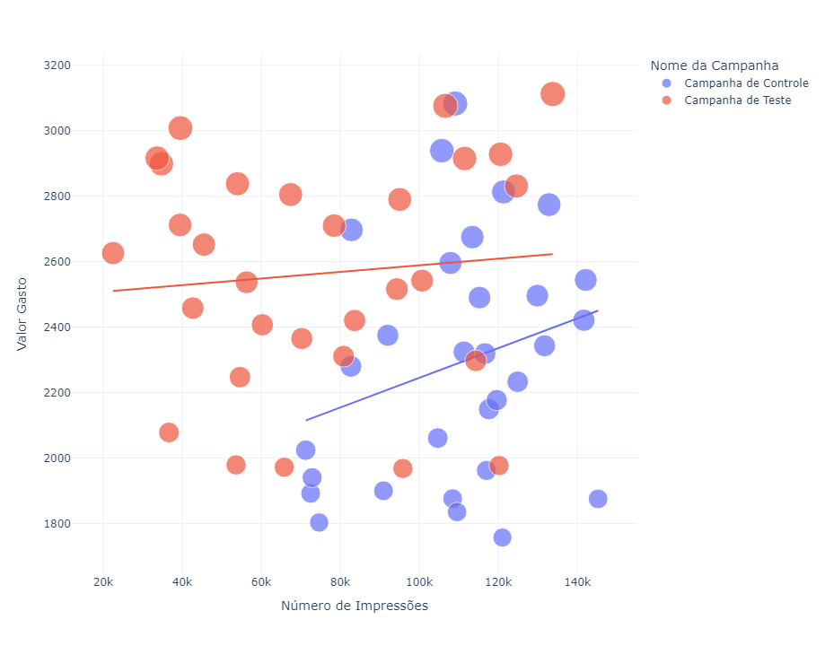
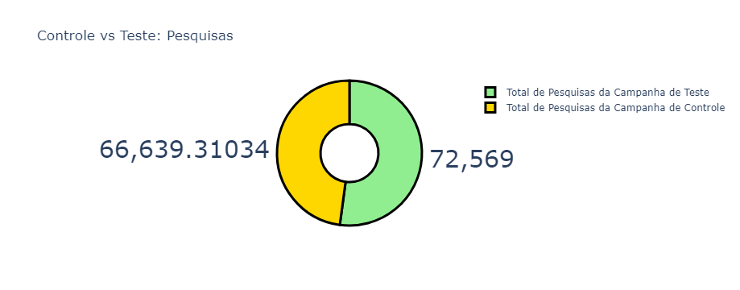
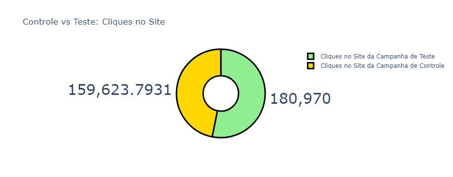
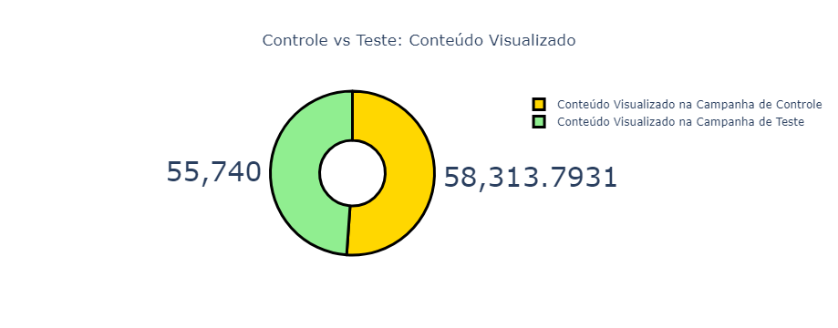
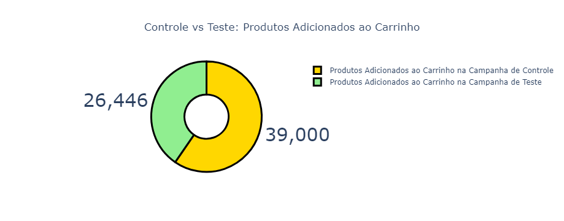
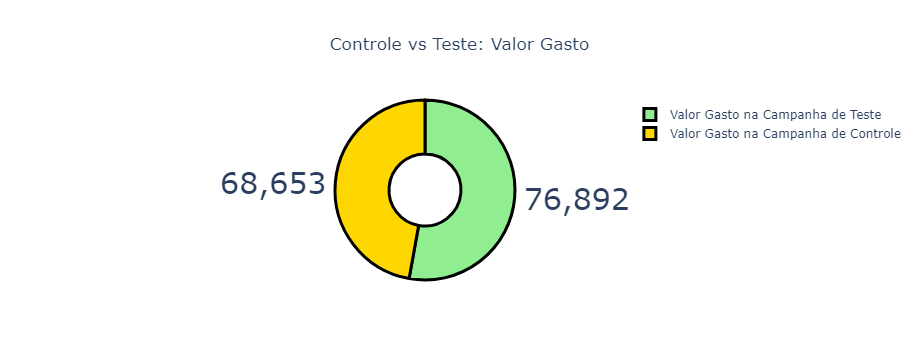
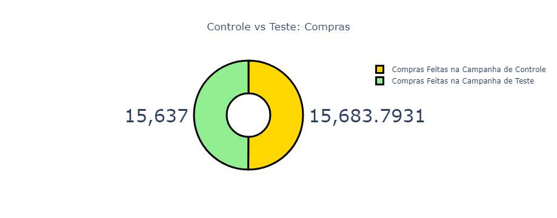
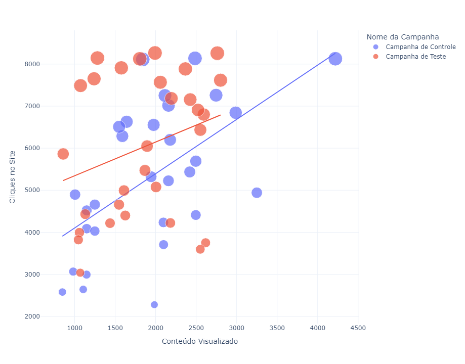
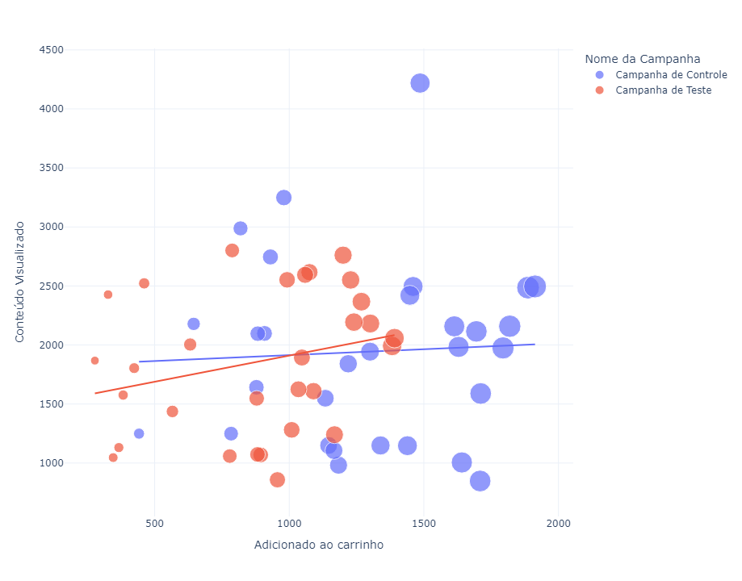
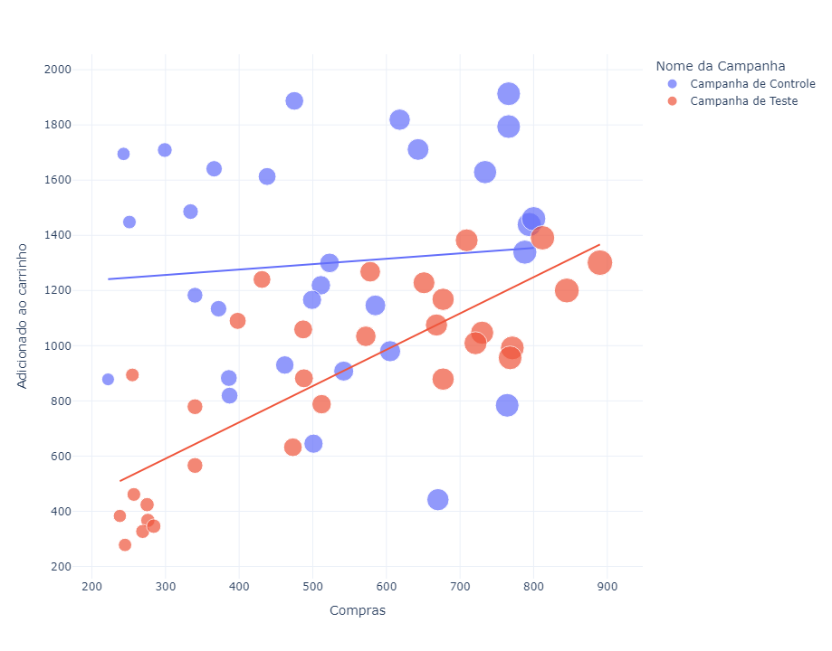

## Análise Estratégica: O Impacto dos Testes A/B

O objetivo deste projeto é identificar a estratégia de marketing mais eficaz entre duas alternativas, utilizando testes A/B para maximizar a conversão de tráfego em vendas, seguidores ou outro objetivo desejado, através da análise de dados utilizando Python.

## Descrição do Dataset:

Conjunto de dados: [disponível no Kaggle](https://www.kaggle.com/datasets/amirmotefaker/ab-testing-dataset/data)

Os testes A/B ajudam a encontrar uma abordagem mais eficaz para atrair clientes, comercializar produtos, aumentar o alcance ou qualquer outra estratégia que ajude um negócio a converter a maioria de seus clientes-alvo em clientes reais.

Glossário do conjunto de dados:

* `Date` -  A data do dia de negociação.
* `Open` - O preço de abertura da ação nesse dia de negociação.
* `High` - O preço mais alto que a ação atingiu durante esse dia de negociação.
* `Low` - O preço mais baixo que a ação atingiu durante esse dia de negociação.
* `Close`- O preço de fecho da ação nesse dia de negociação.
* `Adj Close`- O preço de fecho ajustado, que tem em conta quaisquer acções empresariais, tais como desdobramentos de acções, dividendos, etc.
* `Volume`- O volume de negociação, ou seja, o número de acções negociadas durante esse dia de negociação.

## Etapas do Projeto:

* **Conhecendo o Dataset**: Importação das bibliotecas necessárias e leitura do conjunto de dados.
* **Análises Preliminares**: Exploração inicial dos dados, com o objetivo de responder perguntas e obter insights importantes.
* **Visualização dos Dados**: Utilização de gráficos e histograma para entender a distribuição dos dados e identificar possíveis outliers. Também plotagem de gráficos de dispersão para observar as relações entre as variáveis.

## Análise Exploratória

**Teste A/B para Encontrar a Melhor Estratégia de Marketing**

- Para iniciar o teste A/B, analisarei primeiramente a relação entre o número de impressões obtidas em ambas as campanhas e o valor gasto em cada uma delas. Essa análise preliminar ajudará a entender como os recursos alocados influenciam o alcance e a eficácia das campanhas:

---

**Total de Pesquisas**

- A campanha de controle resultou em mais impressões em relação ao valor gasto nas campanhas. Agora, vamos analisar o número de pesquisas realizadas no site provenientes de ambas as campanhas. Isso nos ajudará a avaliar a efetividade de cada campanha em gerar interesse e engajamento com o conteúdo:

---

**Cliques no Site**

- A campanha de teste resultou em mais buscas no site. Agora, vamos analisar o número de cliques no site provenientes de ambas as campanhas. Essa análise ajudará a entender como as campanhas influenciam a interação dos usuários com o site e a eficácia das chamadas para ação:

---

**Conteúdo Visualizado**

- A campanha de teste obteve mais cliques no site. Agora, vamos analisar a quantidade de conteúdo visualizado após os visitantes acessarem o site a partir de ambas as campanhas. Essa análise permitirá avaliar o engajamento dos usuários com o conteúdo oferecido e a eficácia das campanhas em manter o interesse dos visitantes:

Do autor:
- A audiência da campanha de controle visualizou mais conteúdo do que a da campanha de teste. Embora a diferença não seja muito significativa, considerando que os cliques no site da campanha de controle foram baixos, o engajamento no site é maior do que o da campanha de teste. Isso sugere que, apesar de menor volume de cliques, a campanha de controle conseguiu gerar um maior interesse e envolvimento com o conteúdo visualizado.

---

**Produtos Adicionados ao Carrinho**

- Vamos analisar o número de produtos adicionados ao carrinho a partir de ambas as campanhas. Esta análise ajudará a entender a eficácia de cada campanha em estimular ações de compra e engajamento com os produtos oferecidos:

Do autor:
- Apesar do baixo número de cliques no site, mais produtos foram adicionados ao carrinho na campanha de controle. Isso indica que, embora a campanha de controle tenha gerado menos tráfego, ela foi mais eficaz em converter visitantes em ações de compra.

---

**Valor Gasto**

- Vamos analisar o valor gasto em ambas as campanhas. Esta avaliação permitirá compreender como o investimento foi distribuído e qual campanha ofereceu um melhor retorno sobre o investimento (ROI) em relação aos resultados obtidos:

Do autor:
- O valor gasto na campanha de teste é superior ao da campanha de controle. No entanto, observando que a campanha de controle resultou em mais visualizações de conteúdo e mais produtos adicionados ao carrinho, fica evidente que a campanha de controle foi mais eficiente do que a campanha de teste. Isso sugere que a campanha de controle gerou melhores resultados com um investimento menor.

---

**Compras Realizadas**

- Vamos analisar o valor investido em cada uma das campanhas:

Do autor:
- Há uma diferença de aproximadamente 1% nas compras realizadas entre as duas campanhas publicitárias. Como a Campanha de Controle gerou mais vendas com um investimento menor em marketing, a Campanha de Controle se destaca neste aspecto.

---

**Nome da Campanha**

- Vamos analisar algumas métricas para identificar qual campanha publicitária apresenta melhor taxa de conversão. Inicialmente, examinarei a relação entre o número de cliques no site e o conteúdo visualizado em ambas as campanhas:

Do autor:
- Os cliques no site são mais numerosos na Campanha de Teste, mas o engajamento proveniente desses cliques é mais elevado na Campanha de Controle. Portanto, a Campanha de Controle se destaca neste aspecto.

---

**Adicionados ao Carrinho**

- Analisarei a relação entre a quantidade de conteúdo visualizado e o número de produtos adicionados ao carrinho em ambas as campanhas:

Do autor:
- A Campanha de Controle se destaca!

---

**Compras**

- Vamos analisar a relação entre o número de produtos adicionados ao carrinho e o número de vendas realizadas em ambas as campanhas:

Do autor:
- Embora a Campanha de Controle tenha gerado mais vendas e mais produtos adicionados ao carrinho, a taxa de conversão da Campanha de Teste é mais alta.

## Conclusão

- A partir dos testes A/B realizados, observou-se que a Campanha de Controle resultou em um maior número de vendas e maior engajamento dos visitantes. A Campanha de Controle não apenas levou a um aumento no número de produtos visualizados, mas também resultou em mais produtos adicionados ao carrinho e, consequentemente, mais vendas. Em contraste, a Campanha de Teste apresentou uma taxa de conversão superior de produtos no carrinho.

- Embora a Campanha de Teste tenha demonstrado um melhor desempenho em termos de conversão de produtos visualizados e adicionados ao carrinho, a Campanha de Controle apresentou um desempenho superior em termos absolutos de vendas.

- Dessa forma, a Campanha de Teste é recomendada para a promoção de produtos específicos para um público segmentado, enquanto a Campanha de Controle é mais eficaz para a promoção de múltiplos produtos a um público mais amplo.